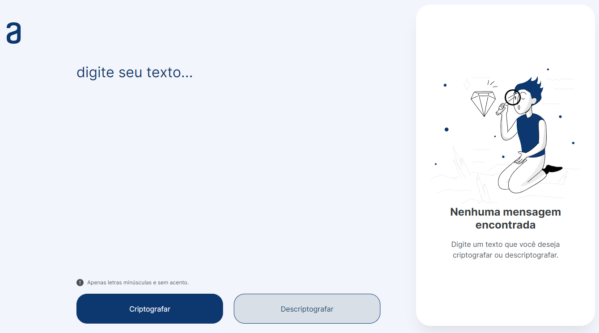
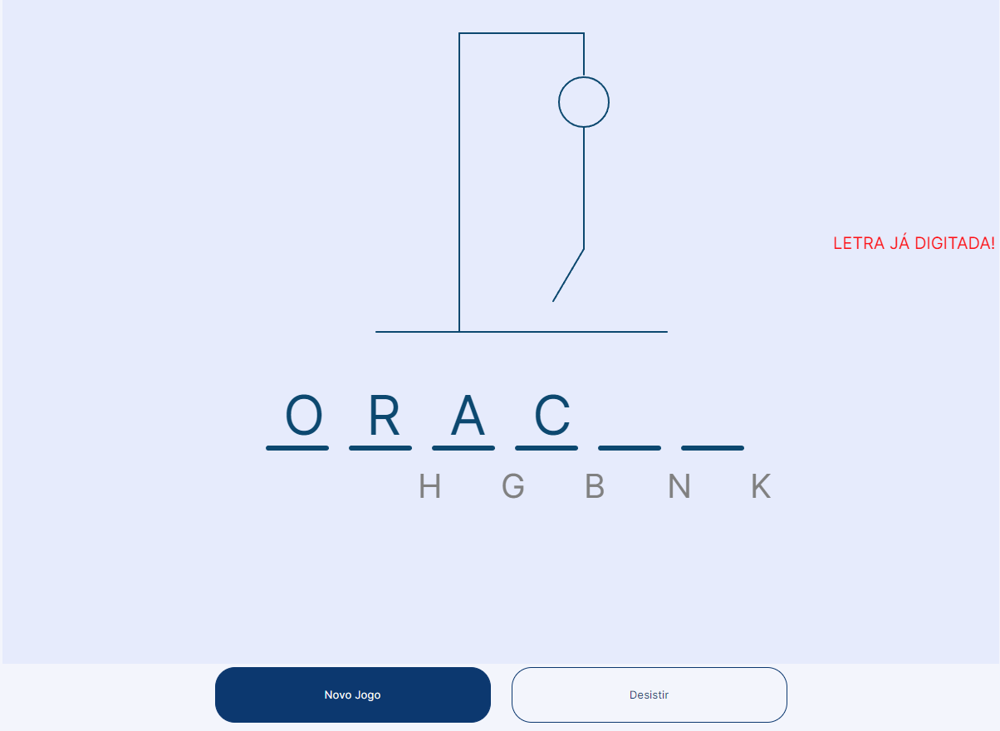

# ORACLE + ALURA - ONE

About
---

Here I'll list the projects created during Oracle ONE.

1st Project
---

[Decodificador](https://lionelsu.github.io/Challenge-Oracle-ONE/Challenge-01-Decodificador/)
---

- Technologies used:
  - HTML
  - CSS
  - JavaScript

2nd Project
---

[Jogo-da-Forca](https://lionelsu.github.io/Challenge-Oracle-ONE/Challenge-02-Challenge-02-Jogo-da-Forca/)
---

- Technologies used:
  - JavaScript ES6 Modules
  - CSS
  - HTML